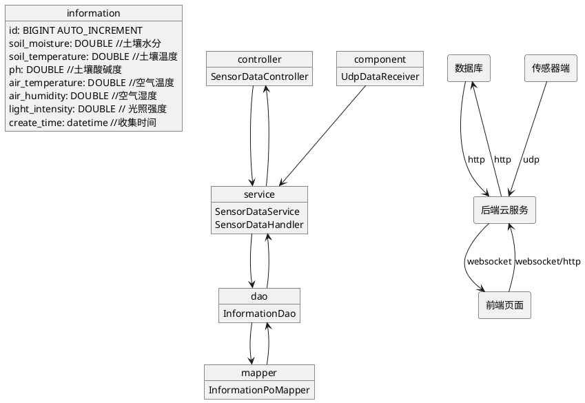

# SmartAgriculture
## 总体架构

## 功能描述
1. **模拟各项数据**：系统通过随机数模拟土壤温度、空气温度、土壤水分、空气湿度、土壤pH值和光照强度等六项指标数据。这些数据在合理范围内随机生成，并按照设定的时间间隔（15秒）发送。
2. **实时展示数据变化**：系统具备实时展示数据变化的功能。通过实时监测界面的图表，用户可以直观地观察到土壤温度、空气温度等指标的实时变化，帮助用户及时了解农作物生长环境的状况。
3. **报警机制**：系统具备报警机制，能够及时发现并报警异常情况。当土壤温度超出设定的阈值时，系统会自动触发报警机制，通过文字颜色变化向用户传达警报信息，以便用户及时采取措施，处理异常情况。
4. **查看统计数据**：系统提供统计数据的查看功能。用户可以在前端界面查看统计数据图表，包括土壤温度每日报警次数和其余各项指标的每日平均值折线图，帮助用户了解农作物生长环境的长期变化趋势。

## 部署与维护

后端云服务部署在Ubuntu服务器上，使用了GitHub的workflow实现自动部署，当项目有更新时，GitHub（actions）会执行相关脚本进行相关的部署。
